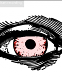
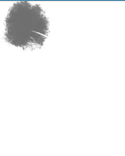

## Features

### Cards

The hand crafted cards in Azure Tarot give life to readings. The cards stand apart from their cardboard cousins with the help of unique animations and added readability. Students won't need a manual here since every card can be clicked to bring up additional information like its background, keywords, and useful questions to ask during a reading.

   

## Readings

Azure Tarot currently supports two different types of readings: the single card reading and the three card reading. Students can look at past readings anytime and add helpful notes to reflect on later.

## Lessons

Tarot is a form of communication. Students want to make personal connections with the cards in their deck. Because of that, the lessons in Azure Tarot ask students to reflect on the cards they find and then write their own descriptions for the cards in the hopes that they'll find deeper meaning in every reading and tailor their experiences.

 

## Website

Check out the website here: https://brewchetta.github.io/Azure-Tarot/

Because the back end has been hosted on Heroku please be patient while the server boots up (this can take between 5 and 20 seconds). If you're still seeing a loading screen or can't sign in, refresh and everything should clear up.

## Technology Used

* Javascript ES6
* React 16.7
* Node 11.3.0

### Backend

* Ruby 2.3.3
* Rails 5.2.2
* BCrypt 3.1.7
* JWT 2.1
* PostgreSQL 10.5

Check out the backend for this repository here:

https://github.com/brewchetta/Azure-Tarot-Backend
